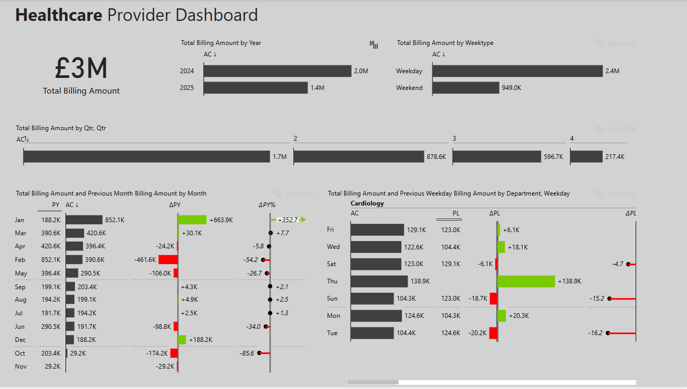

# 🏥 Healthcare Financial Performance Analysis – Power BI Project

## 📋 Project Overview

The idea is to analyze the financial performance of a healthcare center using the provided dataset and develop engaging, interactive dashboards in Power BI. The project seeks to examine the financial health of the healthcare system across various dimensions, such as locations, departments, procedures, and provider efficiency.

---

## 🔍 Business Objective

The core objective is to uncover **key financial trends** and **operational insights** to support strategic decision-making. The analysis will explore:

- Overall revenue and cost distribution
- Financial trends across time (monthly, quarterly, yearly)
- Billing cost breakdown by **state**, **city**, **department**, and **procedure**
- Healthcare provider performance and service type efficiency

---

## 📊 Dashboards Summary 

### 📌 Dashboard 1: **Financial Overview**

_**Insights**_

The healthcare dashboard reveals key insights into cost distribution across cities, departments, procedures, and diagnoses. Edinburgh incurs the highest billing among cities, while Cardiology, Orthopedics, and General Surgery collectively account for over 70% of departmental billing, indicating major cost centers. Procedures such as X-Rays, CT scans, and MRI scans dominate the billing landscape, with X-Rays alone representing 31% of total procedure costs, highlighting diagnostic imaging as a significant cost driver. The total treatment cost stands at £3M, yet only £2M is covered by insurance, leaving patients to pay £1M out-of-pocket—about 33%—suggesting a considerable financial burden and potential gaps in coverage. Medication and room charges are comparatively low (£546K and £180K respectively), while the bulk of spending is driven by treatment costs, pointing to a need for efficiency improvements in care delivery. Billing patterns by diagnosis further show that conditions like asthma, fractures, and migraines have a diverse cost distribution across treatment, medication, and room charges. These insights support more informed decisions in budget allocation, cost containment, and patient financial support.

### 📌 Dashboard 2: **Time-Based Analysis**

The time-based analysis of the second dashboard reveals several important insights into healthcare billing trends, which, when compared with the first dashboard, highlight key areas for strategic focus. A clear pattern emerges showing that 2024 generated £2.0M in billing, while 2025 is trailing at £1.4M, likely due to the year still being in progress. Notably, Q1 accounts for the bulk of revenue (£1.7M), suggesting a front-loaded revenue model. This is further emphasized by January’s billing surge to £852.1K—a 352.7% increase from the previous year—followed by a steep drop in February and erratic trends through May. These fluctuations hint at seasonal spikes, possibly due to winter-related conditions like cardiac events or fractures, as seen in Dashboard 1 where Cardiology and Orthopedics lead departmental billing. Additionally, weekday billing (£2.4M) vastly outweighs weekend billing (£949K), underlining a strong operational bias that may be limiting patient access or revenue potential over weekends. Within the Cardiology department, billing peaks on Thursdays and Fridays, while Mondays and Tuesdays underperform, suggesting an opportunity to rebalance workloads more evenly across the week. Integrating these findings with the first dashboard’s identification of high-cost procedures (e.g., X-rays and CT scans) and departments (Cardiology, Orthopedics, General Surgery), it becomes evident that operational optimization is crucial. Strategic recommendations include rebalancing service delivery throughout the year to avoid overload in Q1, expanding high-demand services into weekends, analyzing the drivers behind the January billing spike for forecasting, and smoothing cardiology appointment distribution. Additionally, introducing rolling financial forecasts that incorporate both cost and time-based insights can better guide staffing, budgeting, and procurement decisions.

### 📌 Dashboard 3: **Provider & Service Efficiency**

